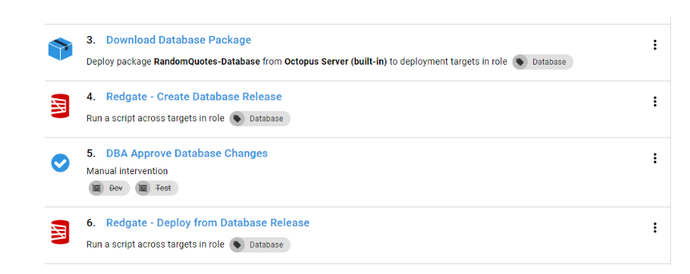
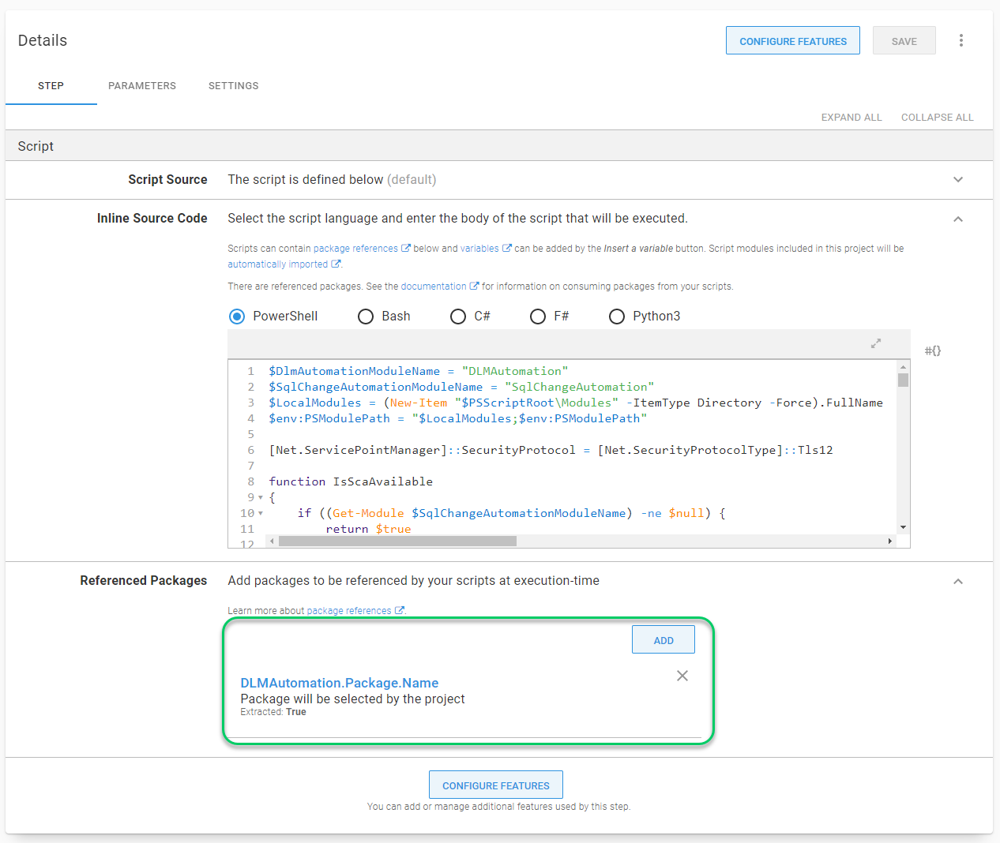

Quite a lot has changed in Octopus Deploy when I originally wrote the article [Database deployment automation using state-based Redgate SQL Change Automation](https://octopus.com/blog/database-deployment-automation-using-redgate-sql-change-automation) back in June/July 2018.  A lot of recommendations are outdated when using Octopus Deploy 2020.x.  In all honesty, when writing that article I had to apply a number of work-arounds.  With Octopus Deploy 2020, that is no longer the case.  I consider this article the definitive guide to using Redgate SQL Change Automation with Octopus Deploy.

!toc

## What's changed

I wasn't joking when I said quite a lot has changed since the first article was written.  A quick glance at the [what's new page](https://octopus.com/downloads/compare?from=2018.6.15&to=2020.1.12) tells the story.  I want to highlight three key features which make database deployments much easier.

### Worker Pools

Prior to Octopus Deploy `2018.7.0`, our recommendation was to leverage a jumpbox to sit between the Octopus Deploy server and SQL Server.  The jumpbox had all the necessary tooling installed on it.  To leverage integrated security, the tentacle could be running as a specific Active Directory service account.

That recommendation creates a single point of failure and a bottleneck for database deployments.  If the jumpbox were to go down all database deployments would stop.  Those deployments also created a [mutex](https://octopus.com/docs/administration/managing-infrastructure/run-multiple-processes-on-a-tentacle-simultaneously) on the tentacle preventing other deployments from running concurrently.  It is possible to disable the mutex, but that only solves one of the problems.

Lets take a step back and look at what is happening on that jumbbox is doing.  The package is extracted by Octopus and the Redgate tooling connects to the desired SQL Server over port 1433.  There is nothing specifically being deployed on that jumpbox.  

That is one of the reasons why we introduced [workers](https://octopus.com/workers) in `2018.7.0`.  Workers solve the main problems with jumpboxes.  With workers, a pool of machines can be created to handle database deployments, if one goes down another worker in the pool can pick it up.  In addition, workers don't have the concept of a mutex.  Multiple concurrent tasks can be run on a single worker at a time.

Worker pools had a major limitation.  They had to be selected at design time, not run time.  This meant you couldn't have a worker pool per environment or region.  

Octopus Deploy `2020.1.0` solves that with the worker pool variable type.

Because it is a variable, the worker pool can be scoped to an environment.  

This means you can have different worker pools per environment.  Perfect for situations where workers must run as a specific Active Directory account or if databases are segmented by subnet.  

### Script package references

The existing Redgate step templates required you to first download the package onto the jumpbox.  This wouldn't work with workers, as there is no guarantee the same server would be used on subsequent steps.

In Octopus Deploy `2018.8.0` we released our initial support for Kubernetes.  Adding support for Kubernetes required the ability to [reference packages](https://octopus.com/blog/script-step-packages) in the `Run a Script` step.  

There was one catch, 

