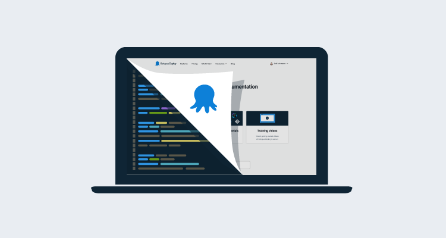

Octopus has had it's documentation on [octopus.com/docs](https://octopus.com/docs) since [we had to move it in a hurry](https://octopus.com/blog/new-home-for-documentation) way back in 2017.

TBD

## Conclusion

Until next time, Happy Deployments!

## Learn more

TBD
